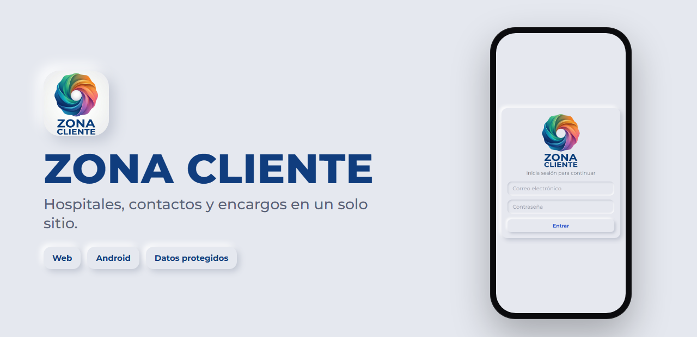

<a href="https://dripdev.dev"></a>

<p align="center">
  
</p>

<p align="center">
  <a href="https://zonacliente.dripdev.dev"></a>
  <a href="https://github.com/roblesgg/zona-cliente/releases/latest"></a>
  
</p>

**Zona Cliente** es la cartera de un comercial que visita hospitales, en el bolsillo. Cada hospital con sus servicios y sus contactos, cada encargo con su fase y todo lo que ganas, a dos toques.

Hecha a medida para una persona real: letra grande, botones grandes y nada que distraiga.

## Qué puedes hacer

| | |
|---|---|
| 🏥 **Hospitales** | Con sus servicios (cardiología, dermatología…) y las personas de contacto. |
| 💼 **Encargos por fases** | De oportunidad a ganado, con ofertas, productos y notas. |
| 📞 **Contactos** | Llamar o escribir desde la ficha. |
| 📄 **Informes en PDF** | Listos para enviar. |
| 📅 **Calendario y avisos** | Visitas y recordatorios en el móvil. |
| ✅ **Comisión automática** | Pones ingresos y porcentaje, y calcula lo que ganas. |

## Úsala

- **En el navegador:** [zonacliente.dripdev.dev](https://zonacliente.dripdev.dev)
- **En Android:** baja `zona-cliente-latest.apk` de la [última versión](https://github.com/roblesgg/zona-cliente/releases/latest).

Cada persona entra con su cuenta y solo ve sus propios datos.

## Hecho con

React y Vite, Supabase para datos, inicio de sesión y archivos, y Capacitor para la app de Android.

<details>
<summary><b>Para desarrollar</b></summary>

<br>

```bash
npm install
cp .env.example .env    # VITE_SUPABASE_URL y VITE_SUPABASE_ANON_KEY
npm run dev             # http://localhost:5173
```

Base de datos: ejecuta en el SQL Editor de Supabase, por orden, `supabase/schema.sql`, `policies.sql`, `migracion-oportunidades.sql` e `informes.sql`.

Cómo se levantaron los requisitos con el usuario real: [`docs/analisis-requisitos.md`](docs/analisis-requisitos.md).

</details>

---

<p align="center"><sub>Un producto de <a href="https://dripdev.dev"><b>DripDev</b></a> · hecho por Álvaro Robles</sub></p>
