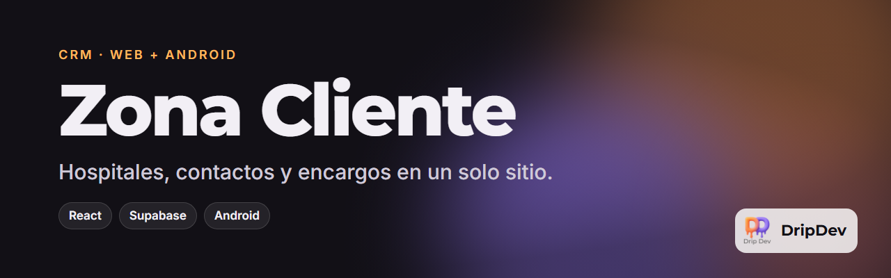

<p align="center">
  
</p>

<p align="center">
  <a href="https://github.com/roblesgg/zona-cliente/releases/latest"></a>
  <a href="https://zonacliente.vercel.app"></a>
  
  
</p>

**Zona Cliente** es un CRM hecho a medida para un comercial de instrumental quirúrgico que visita hospitales. Reúne en un solo sitio cada hospital con sus servicios y contactos, las empresas proveedoras y cada encargo desde que es una oportunidad hasta que se cobra. Funciona igual en el ordenador y en el móvil.

<!-- Capturas: añade las imágenes en docs/capturas/ y descomenta esta sección.
## Capturas
<p align="center">
  
  
  
</p>
-->

## Qué puedes hacer

- **Hospitales** con sus servicios (cardiología, dermatología…) y las personas de contacto de cada uno.
- **Empresas** proveedoras y su catálogo de productos con precio orientativo.
- **Encargos por fases**, de oportunidad a ganado, con ofertas, productos y notas de seguimiento.
- **Comisión automática**: pones ingresos y porcentaje y calcula lo que ganas.
- **Panel de inicio** con beneficio potencial y ganado, y gráficos por mes.
- **Calendario y avisos** con notificaciones en el móvil.
- **Informes en PDF** listos para enviar.
- **Adjuntos**: fotos y documentos en cada ficha.
- **Tus datos son tuyos**: inicio de sesión y reglas de seguridad para que cada usuario vea solo lo suyo.

## Úsala

- **En el navegador:** [zonacliente.vercel.app](https://zonacliente.vercel.app)
- **En Android:** descarga `zona-cliente-latest.apk` de la [última versión](https://github.com/roblesgg/zona-cliente/releases/latest).

## Hecho con

React y Vite para la interfaz, Supabase para la base de datos, el inicio de sesión y los archivos, Capacitor para el APK y jsPDF para los informes. El APK se compila solo con GitHub Actions.

## Desarrollo

```bash
npm install
cp .env.example .env    # rellena VITE_SUPABASE_URL y VITE_SUPABASE_ANON_KEY
npm run dev             # http://localhost:5173
```

Para preparar la base de datos, ejecuta en el SQL Editor de Supabase, por orden, `supabase/schema.sql`, `supabase/policies.sql`, `supabase/migracion-oportunidades.sql` y `supabase/informes.sql`.

Cómo se levantaron los requisitos con el usuario real: [`docs/analisis-requisitos.md`](docs/analisis-requisitos.md).

## Estado

En uso real. Versión actual en la insignia de arriba.

---

<p align="center">
  <br>
  Un producto de <b>DripDev</b> · hecho por Álvaro Robles
</p>
